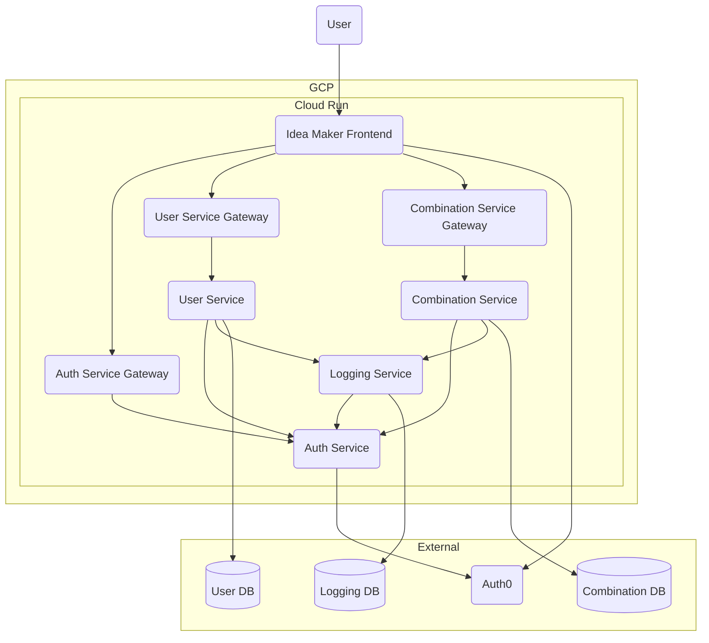

# Idea Maker

- [Auth Service](https://github.com/qkitzero/auth-service)
- [User Service](https://github.com/qkitzero/user-service)
- [Combination Service](https://github.com/qkitzero/combination-service)
- [Logging Service](https://github.com/qkitzero/logging-service)

